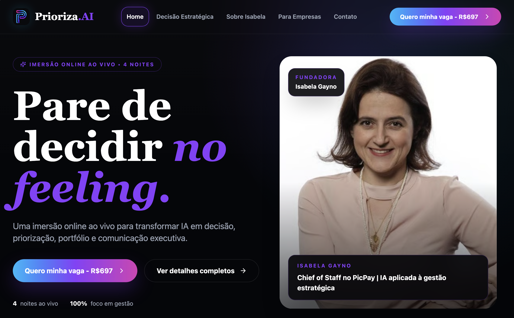
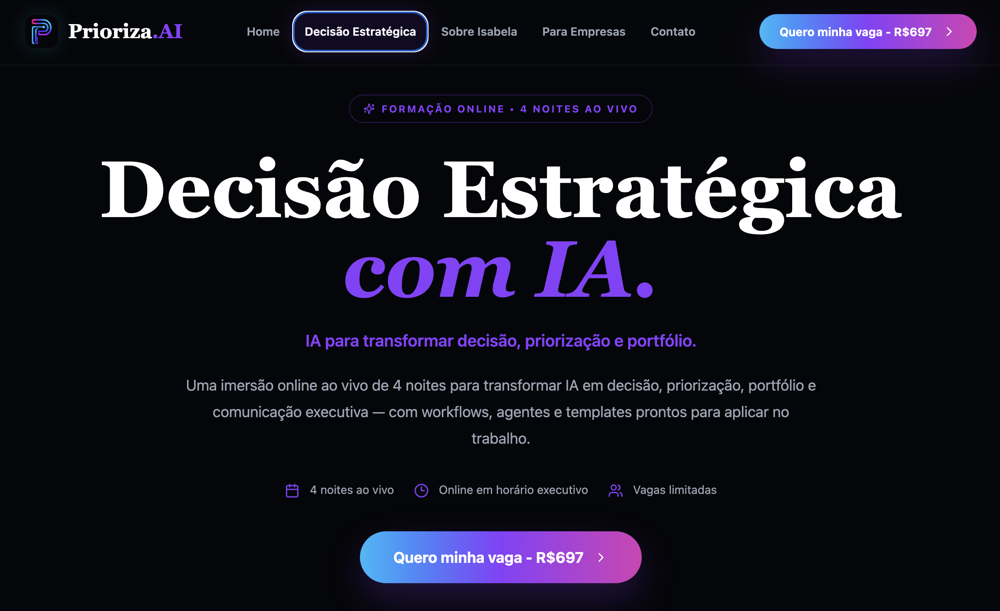
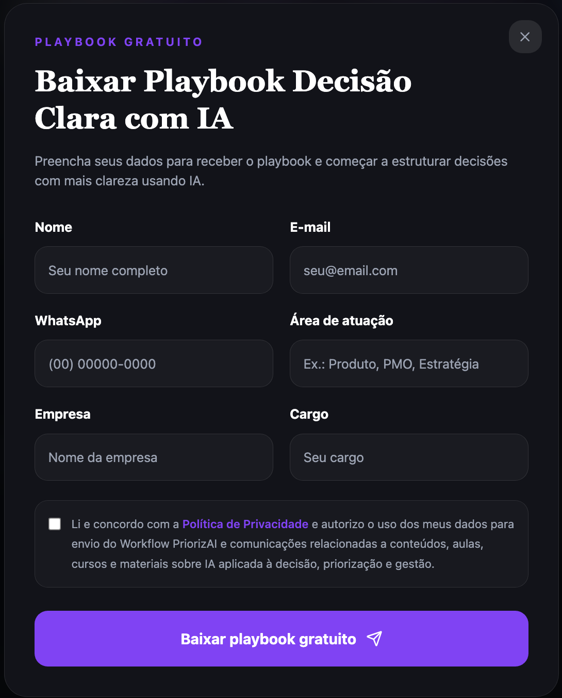
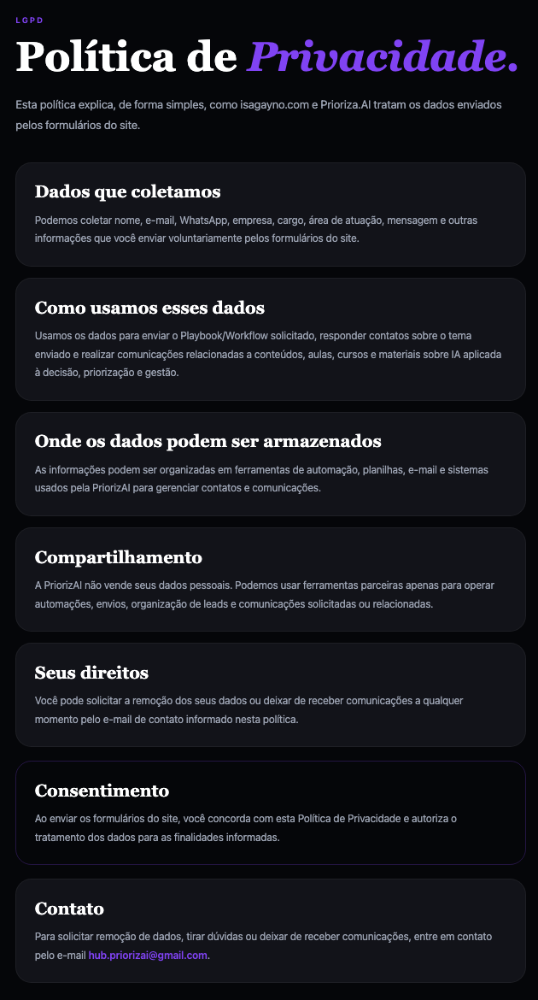

# PriorizaAI — Case Study

Case study de desenvolvimento de uma landing page com automação de captação de leads para a PriorizaAI, projeto focado em IA aplicada à decisão, priorização e gestão estratégica.

> Este repositório é um estudo de caso público. URLs sensíveis, credenciais, webhooks reais, planilhas privadas e dados de leads não são expostos.

## Projeto online

Site em produção: [isagayno.com](https://www.isagayno.com)

## Visão geral

O projeto teve como objetivo estruturar uma presença digital profissional para apresentar a imersão **Decisão Estratégica com IA**, capturar leads interessados em um workflow/playbook gratuito e automatizar a entrega do material por e-mail.

Além do site, foi criado um fluxo simples de automação para organizar os dados recebidos, enviar notificações e reduzir trabalho manual.

## Problema

A PriorizaAI precisava de uma estrutura simples e funcional para:

* apresentar a oferta principal;
* captar leads interessados em IA aplicada à decisão;
* entregar automaticamente um material gratuito;
* armazenar dados de contato;
* receber mensagens comerciais;
* manter uma página pública de Política de Privacidade;
* registrar consentimento básico nos formulários.

## Solução

Foi criada uma landing page responsiva integrada a automações com n8n.

O fluxo permite que uma pessoa preencha o formulário no site, tenha seus dados organizados em uma planilha e receba automaticamente o material solicitado por e-mail.

Também foi criado um fluxo separado para mensagens comerciais enviadas pelo formulário de contato.

## Funcionalidades implementadas

* Landing page responsiva
* Integração com Sympla
* Formulário de captura de lead
* Webhook de automação com n8n
* Armazenamento de leads em Google Sheets
* Envio automático de e-mail com material
* Formulário de contato comercial
* Notificação interna por e-mail
* Página pública de Política de Privacidade
* Checkbox obrigatório de consentimento LGPD
* Deploy em domínio próprio
* Documentação do fluxo de automação

## Stack utilizada

* React
* Vite
* TypeScript
* Tailwind CSS
* Vercel
* GitHub
* n8n
* Google Sheets
* Gmail

## Fluxo de automação

### Playbook / Workflow

```text
Usuário preenche formulário no site
→ Webhook n8n recebe os dados
→ Dados são organizados
→ Lead é salvo no Google Sheets
→ E-mail automático é enviado com o material
→ Site exibe mensagem de sucesso
```

### Contato comercial

```text
Usuário envia formulário de contato
→ Webhook n8n recebe os dados
→ Dados são salvos na aba de contatos
→ Equipe recebe notificação por e-mail
→ Site exibe mensagem de sucesso
```

## Privacidade e consentimento

O site possui uma página pública de Política de Privacidade e campos obrigatórios de consentimento antes do envio dos formulários.

Os dados coletados são usados para envio de materiais, contato sobre temas solicitados e comunicações relacionadas à PriorizaAI.

Este case study não expõe dados reais de usuários, URLs privadas de webhook, credenciais ou planilhas internas.

## Habilidades demonstradas

Este projeto demonstra habilidades em:

* desenvolvimento front-end com React e TypeScript;
* criação de landing page responsiva;
* integração com webhooks;
* automação com n8n;
* organização de leads;
* envio automático de e-mails;
* deploy com Vercel;
* versionamento com Git e GitHub;
* estruturação de funil simples de aquisição;
* documentação técnica e comercial;
* noções práticas de privacidade e consentimento.

## Resultado do projeto

Foi criada uma estrutura funcional de presença digital e captação de leads para a PriorizaAI, integrando landing page, formulário, automação com n8n, envio automático de e-mail e organização dos contatos em planilha.

O projeto demonstra a aplicação prática de desenvolvimento web, automação e estruturação de funil em um contexto real de negócio.

## Screenshots

### Home



### Seção do produto



### Formulário do Playbook



### Política de Privacidade


